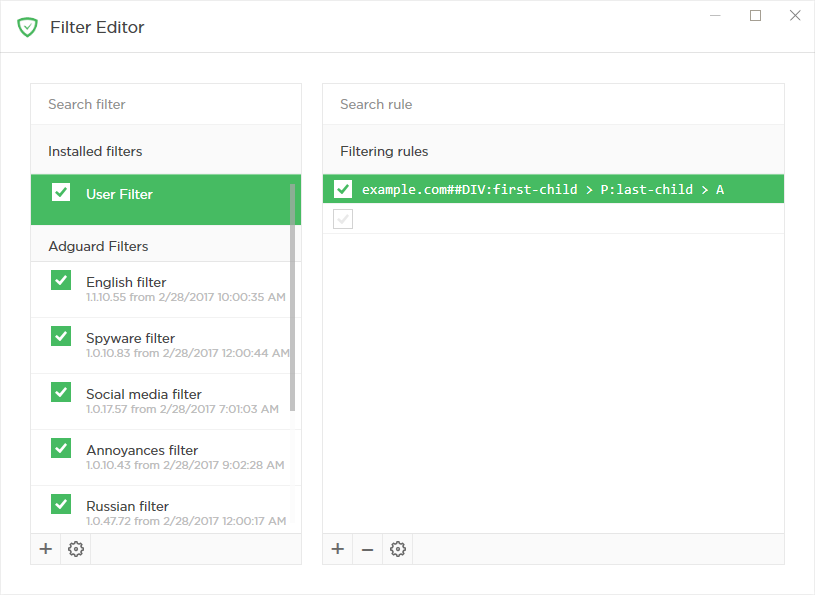
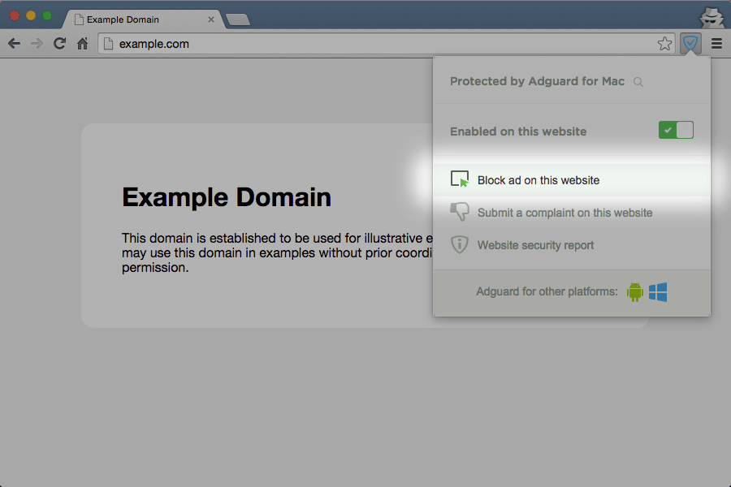
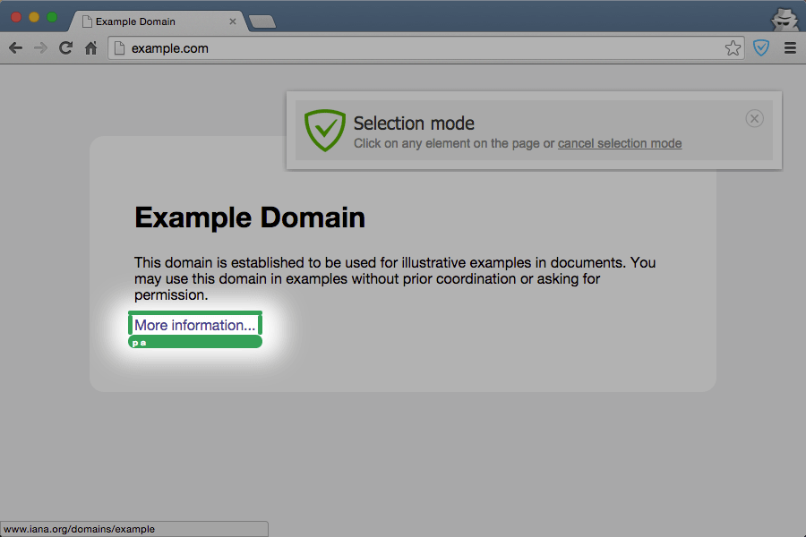
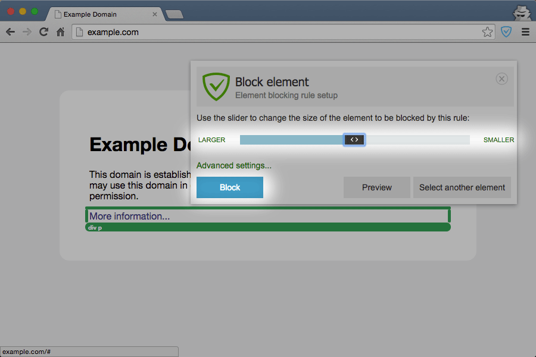
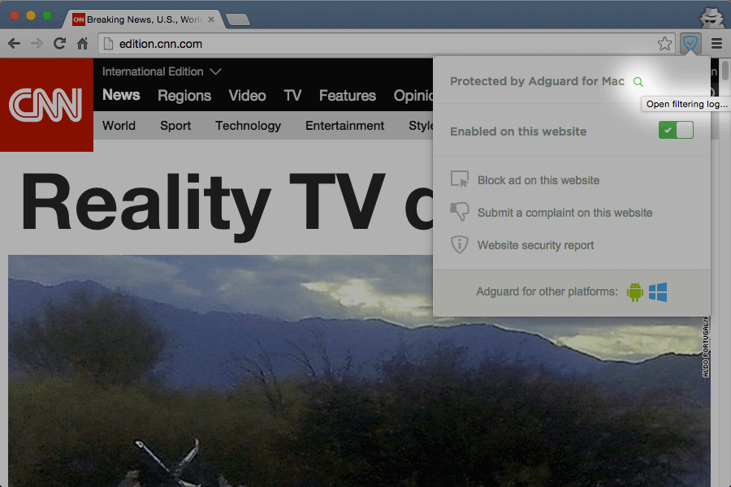
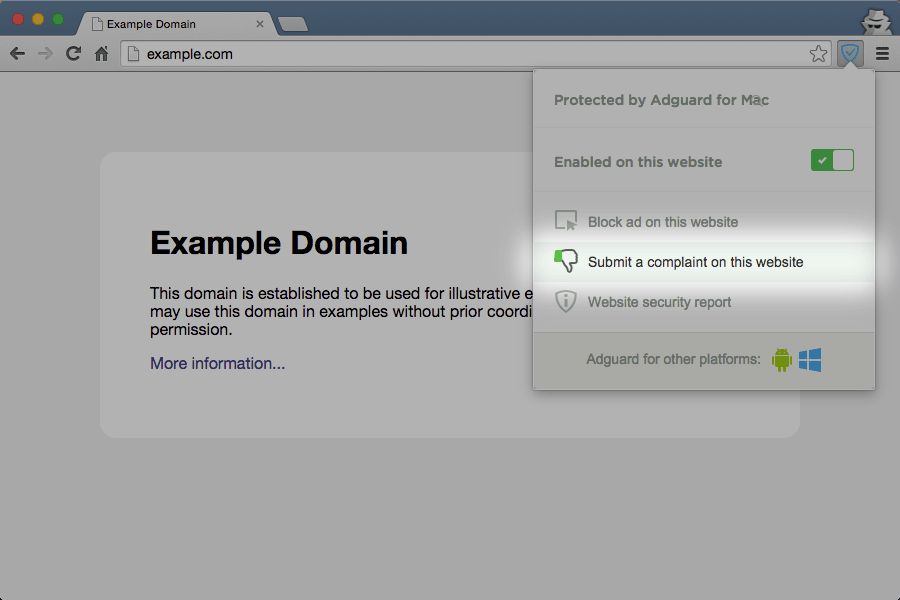
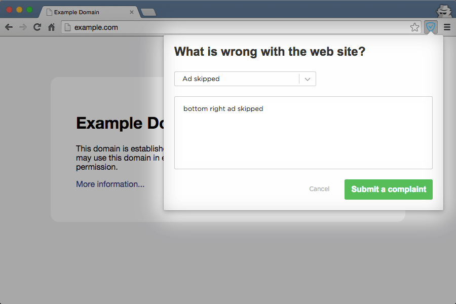
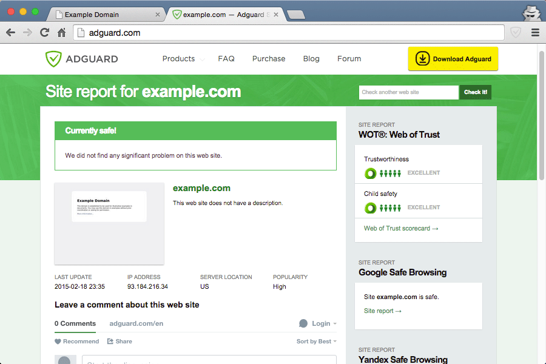

## Extension and Program Integration

If you use Adguard, our browser extension may become a very useful additional tool, which will completely replace the browser-based “Adguard Assistant” module.

How does Adguard extension work in integration mode with Adguard for Windows or macOS?

*  Extension icon color changes to blue;

*  Extension doesn’t filter pages any more - now this function lays completely on desktop program;

*  Extension settings are ignored; instead, desktop program’s settings are used.

## Integration mode features

*  [Enable or disable filtering on a website](#1)
*  [Select and block any element manually](#2)
*  [View filtering log](#3)
*  [Send complaint on a website](#4)
*  [View website security report](#5)

###  Enable or disable filtering on a website
 	
Disabling the filtering on a website, creates an exception rule in the user filter. There are two options to enable the filtering:

1. Using the same switcher in extension, which disabled the filtering;

2. Removing the rule from user filter.

### Select and block any element manually

In the extension, select “Block ad on this website”;

On a page, select an object that needs to be removed;
    

    
Adjust the area to be blocked with a “slider” and click “Block” to proceed.
The rule created by Assistant falls into the user filter. This rule can be easily removed in the program.

### View filtering log

To open filtering log click on magnifying glass icon in extension menu;

You can view detailed report on every filtered page;
    

Each request can be blocked by clicking on a respective button.
    

### Send complaint on a website

In the extension, select “Submit a complaint on this website”;

Choose a reason for complaint on this website and leave your comment.
Submitted complaints are automatically grouped by websites and are handled in descending order by number of complaints;

	
Note that after sending a complaint, solving the problem may take some time.

If you want to speed up the process, then leave a message about unblocked ads in our [Forum](http://forum.adguard.com/forumdisplay.php?53-Missed-Ads).

### View website security report

	
To see website security report, select the respective line in the extension menu;

	
A page with website’s reputation based on Web of Trust statistics will be opened in a new tab.