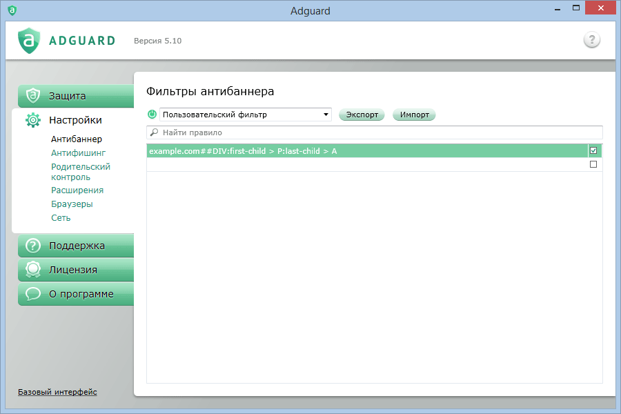
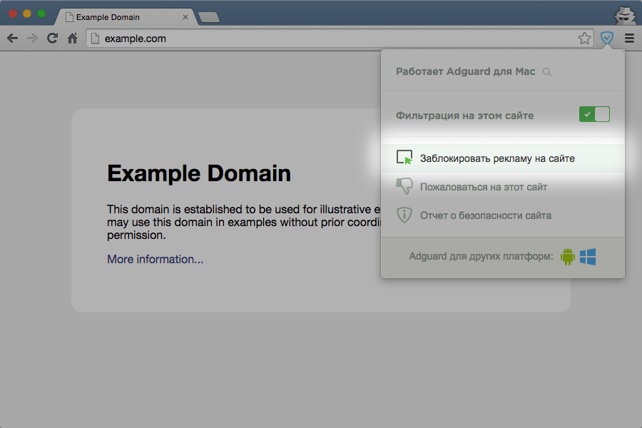
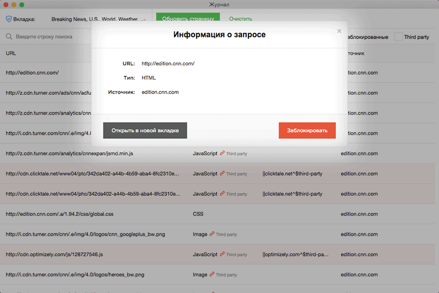
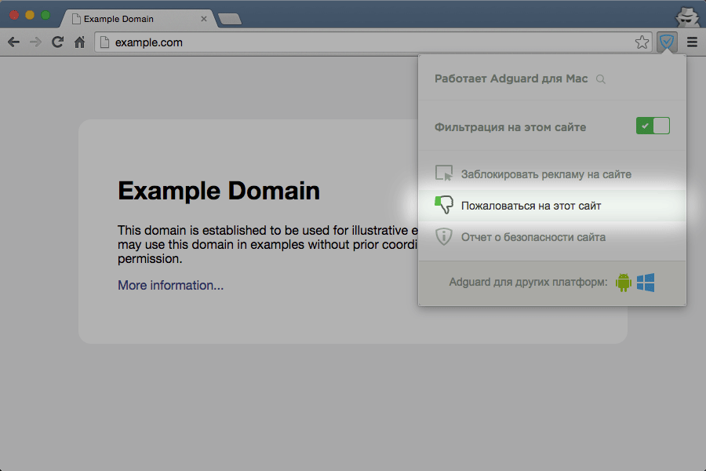
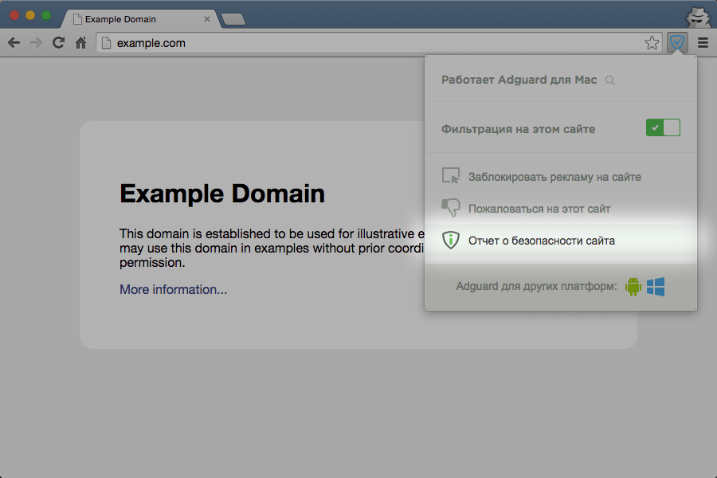

## Интеграция расширения и программы

Если вы используете Adguard, наше браузерное расширение может стать для вас очень полезным дополнением, которое полностью заменит браузерный модуль «Помощник Adguard».

Как именно работает расширение в режиме интеграции с программой для Windows или macOS?

* Цвет значка расширения меняется на синий;

* Расширение больше не фильтрует рекламу — теперь эта функция передаётся программе;

* Настройки расширения игнорируются, вместо них используются настройки программы.

## Функции расширения в режиме интеграции

*  [Включение и отключение фильтрации на сайте](#1)
*  [Ручная блокировка рекламы на странице](#2)
*  [Просмотр журнала фильтрации](#3)
*  [Отправка жалобы на сайт](#4)
*  [Просмотр отчета о безопасности сайта](#5)

###  Включение и отключение фильтрации на сайте
 	
При отключении фильтрации создается исключающее правило в пользовательском фильтре. Вернуть фильтрацию можно двумя способами:

1. Тем же переключателем в расширении, которым была отключена фильтрация;

2. Удалить правило из пользовательского фильтра основной программы.

### Ручная блокировка рекламы на странице

Выберите в меню расширения «Заблокировать рекламу на сайте»;

Выделите объект на странице, который необходимо убрать;
    

    
Откорректируйте блокируемую область «бегунком» и нажмите "Готово".
Созданное помощником правило попадает в пользовательский фильтр. Удалить правило можно в самой программе.

### Просмотр журнала фильтрации

Чтобы открыть журнал фильтрации щелкните мышью на значке лупы в меню расширения;

Вы можете просмотреть подробный отчет о фильтрации каждой страницы;
    

Любой запрос можно заблокировать, щелкнув мышью на соответствующей кнопке.
    

### Отправка жалобы на сайт

Выберите в меню расширения «Пожаловаться на этот сайт»;

Выберите причину жалобы на сайт и оставьте свой комментарий.

Присланные жалобы автоматически группируются по сайтам и разбираются в порядке уменьшения количества жалоб;

Обратите внимание, что с момента отправки жалобы до исправления проблемы может пройти какое-то время.
 
Если вы хотите ускорить процесс, то оставьте сообщение о незаблокированной рекламе на нашем форуме.

### Просмотр отчета о безопасности сайта

	
Чтобы посмотреть отчет о безопасности сайта, выберите соответствующий пункт в меню расширения;

	
В новой вкладке откроется страница с репутацией сайта на базе статистики Web of Trust.